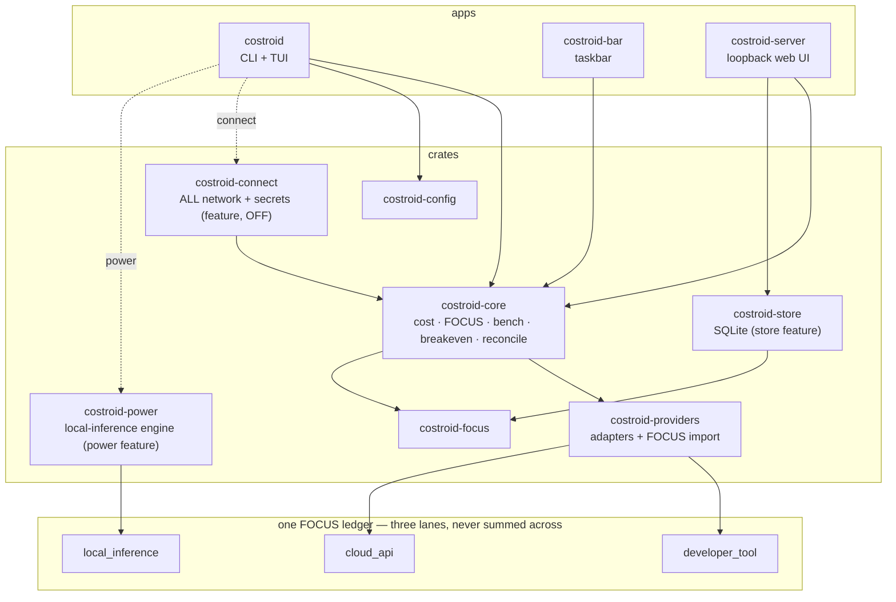

# Costroid

> Local-first, FOCUS-native cost and limit visibility for your AI coding tools — right in your terminal.


## The problem

AI coding tools spread your spend across three places no single tool ties together: a **subscription** with opaque 5-hour and weekly caps (Claude Code, Codex) you only notice when you hit them; a metered **API bill** in real dollars by model; and **your own hardware**, where running an open-weights model locally has a real but invisible energy-plus-amortization cost. Costroid puts all three in one place — by default entirely from the local logs those tools already write, with **nothing leaving the machine** — and normalizes everything into the open [FOCUS](https://focus.finops.org) standard so it is portable and vendor-neutral. The three are modeled **separately**: a subscription has a quota % and a reset timer, an API key has summable per-model dollars, and local inference has a measured/estimated cost-per-token with a break-even against the cloud.

> 🎬 **Hero GIF — capture pending M3b** *(no committed asset yet — run `make demo` to see the tool now).* Every local-inference figure Costroid shows today is **estimated — pending M3b measurement** except the one captured run (`gemma-4-31b-dense`); see [methodology](docs/methodology.md).

**Feature-complete at v0.7.0.** Edition 2021, Apache-2.0. MSRV 1.88 (libraries + CLI), 1.92 (the taskbar).

## Install

```bash
# CLI — macOS / Linux (shell) or Windows (PowerShell)
curl --proto '=https' --tlsv1.2 -LsSf https://github.com/Costroid/costroid/releases/latest/download/costroid-installer.sh | sh
powershell -ExecutionPolicy Bypass -c "irm https://github.com/Costroid/costroid/releases/latest/download/costroid-installer.ps1 | iex"
brew install Costroid/tap/costroid   # Homebrew
npx costroid                         # npm
cargo install costroid               # crates.io (or `cargo binstall costroid` for a prebuilt binary)
```

**Taskbar (`costroid-bar`):** binary archives or `cargo install costroid-bar` (no npm/Homebrew this cut).

## Quickstart

See the whole product end-to-end — all three FOCUS lanes in one ledger — over bundled **synthetic** data, **fully offline, no hardware, no cloud account**:

```bash
make demo          # chains export + import + bench + breakeven into one FOCUS 1.3 ledger
make demo-verify   # proves the artifact is byte-identical across re-runs (SOURCE_DATE_EPOCH-pinned)
make help          # every target
```

Discovery points only at `samples/local-logs`, so the demo can never read your real logs. Windows without `make`: run the same ordered `cargo run -p costroid --features power -- …` steps (see the `Makefile`; PowerShell 7+ for byte-identical UTF-8 output).

## Commands

| Command | What it does |
|---|---|
| `costroid` | Live Claude + Codex 5h/weekly limits with reset countdowns, plus current API spend by model |
| `costroid trends` | Spend over time — `--period day\|week\|month\|year`, `--group model\|app\|total` |
| `costroid frontier` | Cost-vs-quality frontier and where your spend sits (advisory, API-cost rows) |
| `costroid statusline` / `setup-statusline` | One-line shell/tmux/Starship status; wire Claude Code's `statusLine` to capture quota (`--undo`) |
| `costroid export --format json\|csv` | FOCUS 1.3-conformant export |
| `costroid import <file>` | Import a foreign FOCUS v1.2 export (AWS Data Exports / Bedrock, multi-currency) → cloud lane; pure local parse |
| `costroid alerts` / `--check` | Opt-in threshold alerts (off by default); `--check` is cron-friendly (exit 0/1/2) |
| `costroid --live` / `--plain` | Auto-refreshing interactive view / one-shot ASCII, no color (screen-reader & pipe friendly) |

- **Connections** (`--features connect`, off by default): `connect` / `disconnect` / `connections [--check]` link your own Anthropic/OpenAI usage-API key (stdin-only, instant revoke); `reconcile` puts your local estimate beside the vendor's billed invoice.
- **Local-inference economics** (`--features power`, off by default, pure local compute): `bench` estimates a local model's cost-per-token (or `--measure`s it with a wall meter); `breakeven` computes the local-vs-cloud crossover — *"breaks even at N tokens/day, or never (or infeasible), with the reason"* — as a **range + assumption stamp**, never a single hero number.

## Surfaces

- **TUI** — 9 numbered tabs (now / trends / providers / models / history / budget / forecast / anomalies / activity) + an `a` frontier overlay (and a `b` break-even overlay under `--features power`). Braille dots in Costroid's palette; `--plain`/`NO_COLOR` strip all color, byte-identically.
- **Taskbar** (`costroid-bar`) — tray glance (most-constrained quota meter) + a live cockpit (Overview, alerts, Budget/Forecast/Anomalies/Providers). egui/eframe, AccessKit on. macOS/Windows tray not yet field-verified.
- **Local web app** (`costroid-server`) — a **loopback-only** (`127.0.0.1`) server over your stored ledger: timeline, comparison, and break-even views. Server-rendered HTML + `?plain` + a JSON API, all assets embedded, **zero external requests**. A separate binary, never linked into the CLI.

## What this does that ccusage doesn't

[ccusage](https://github.com/ryoppippi/ccusage) is the great single-tool token-cost reader; Costroid is a broader, standards-native cost lens. These are **feature contrasts**, not a ranking:

| Capability | ccusage | Costroid |
|---|---|---|
| Claude Code / Codex token cost from local logs | yes | yes |
| **FOCUS-native output** (the open FinOps standard) | no | **FOCUS 1.3 in/out** |
| **Three-lane ledger** — developer-tool + cloud-API + local-inference, never summed across | dev-tool only | **all three lanes** |
| **Cloud/API cost lane** — import an AWS / Bedrock FOCUS bill, multi-currency | no | **yes** (`import`) |
| **Local-inference economics** — measured/estimated cost-per-token on your own hardware | no | **yes** (`bench`) |
| **Break-even** — local-vs-cloud crossover, with the reason | no | **yes** (`breakeven`) |
| **Loopback web UI** — a local-only (`127.0.0.1`) three-view app, zero external requests | no | **yes** (`costroid-server`) |
| **Estimate-vs-invoice reconciliation** against the provider's bill | no | **yes** (`reconcile`) |
| **Zero-network default**, enforced (strace + forbidden-crates gates) | n/a | **yes** |

## Architecture

A Rust Cargo workspace — **10 members** (3 apps + 7 crates) — feeding one three-lane FOCUS ledger; the loopback web server is a separate binary that never links the CLI or the local-inference engine. Full canon: [docs/ARCHITECTURE.md](docs/ARCHITECTURE.md).



## Guarantees

- **Local-first, zero-network default** — reads local logs only, no network calls (enforced by strace offline-acceptance + a two-tier forbidden-crates test). Network happens only under `--features connect`, on an explicit action, as an HTTPS GET to the one provider host you authorized.
- **No telemetry, ever.** Any update check is opt-in and off by default.
- **Secrets live only in your OS keychain** (`keyring`) — stdin-only, never written to disk/config/logs, never routed through any server. See [SECURITY.md](SECURITY.md).
- **Cost is always an estimate** (your tokens × current prices), built to reconcile against the provider invoice (the source of truth).
- **`--plain` everywhere**, never color alone; permissive licenses only.

## More

Providers: Claude Code + Codex (full), Cursor (detect-only). Cursor live quota, Copilot, Antigravity, Gemini own-key are discovery-gated, never built speculatively — [docs/ROADMAP.md](docs/ROADMAP.md). Release history: [CHANGELOG.md](CHANGELOG.md). Agent build rules: [CLAUDE.md](CLAUDE.md).

## License

Apache-2.0. See [LICENSE](LICENSE). Costroid uses only local and provider-sanctioned data sources and never reuses a credential or session against an undocumented or internal endpoint; if you connect your own key, you remain responsible for each provider's terms of service.
