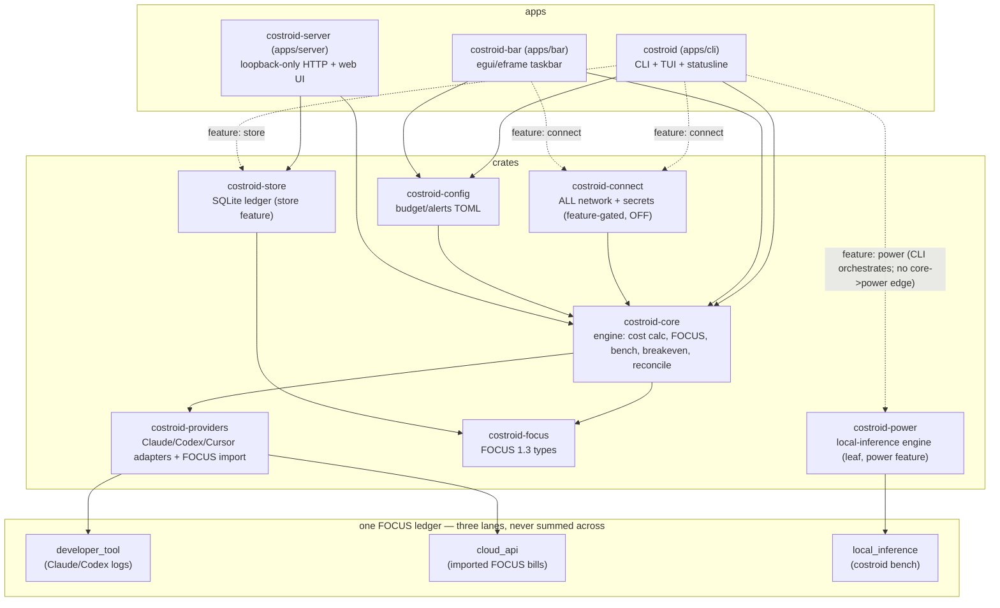

# Costroid

> Local-first, FOCUS-native cost and limit visibility for your AI coding tools — right in your terminal.


## The problem

AI coding tools spread your spend across three places that no single tool ties together: a **subscription** with opaque 5-hour and weekly caps (Claude Code, Codex) that you only notice when you hit them; a metered **API bill** in real dollars by model; and — increasingly — **your own hardware**, where running an open-weights model locally has a real but invisible energy-plus-amortization cost. Costroid puts all three in one place, by default entirely from the local logs those tools already write, with **nothing leaving the machine**, and normalizes everything into the open [FOCUS](https://focus.finops.org) standard so it is portable and vendor-neutral. Subscription limits and API costs are modeled **separately**, because they are different things: a subscription has a quota % and a reset timer; an API key has summable per-model dollars; and local inference has a measured/estimated cost-per-token with a break-even against the cloud.


> **Hero GIF: capture pending M3b.** The 60–90s screen recording of a real run is captured on real hardware after the M3b wall-meter measurement run; until then this placeholder stands in (no committed asset — *capture pending M3b*). Every local-inference figure Costroid shows today is **estimated — pending M3b measurement** (see [methodology](docs/methodology.md)).

**Feature-complete at v0.6.0.** Edition 2021, Apache-2.0. MSRV 1.88 (libraries + CLI), 1.92 (the taskbar).

## Install

**CLI (`costroid`):**

```bash
# macOS / Linux (shell)
curl --proto '=https' --tlsv1.2 -LsSf https://github.com/Costroid/costroid/releases/latest/download/costroid-installer.sh | sh
# Windows (PowerShell)
powershell -ExecutionPolicy Bypass -c "irm https://github.com/Costroid/costroid/releases/latest/download/costroid-installer.ps1 | iex"
brew install Costroid/tap/costroid     # Homebrew
npx costroid                           # npm
cargo binstall costroid                # prebuilt binary, no compile
cargo install costroid                 # from crates.io (compiles)
```

**Taskbar (`costroid-bar`):** downloadable binary archives, or `cargo install costroid-bar`. (No npm/Homebrew this cut.)

Build from source: `git clone https://github.com/Costroid/costroid && cd costroid && cargo install --path apps/cli`.

## Quickstart / Demo

See the whole product end-to-end — all three FOCUS lanes in one ledger — over bundled **synthetic** sample data, **fully offline, with no hardware and no cloud account**:

```bash
make demo        # Linux / macOS
```

`make demo` chains `export` (synthetic dev-tool logs → `developer_tool`) + `import` (synthetic AWS Bedrock FOCUS v1.2 → `cloud_api`) + `bench` (estimated Gemma 4, no hardware → `local_inference`) + `breakeven` (local-vs-cloud, a range), then merges them into a deterministic three-lane FOCUS 1.3 ledger at `target/demo/demo-ledger.csv`. It points discovery only at `samples/local-logs` (so it can never read your real logs) and pins the clock via `SOURCE_DATE_EPOCH`, so the artifact is **byte-identical across re-runs** (`make demo-verify` proves it; `make help` lists every target). Every figure is synthetic and estimated — *"estimated — pending M3b measurement"*. *(A hero-GIF screen recording is capture-pending M3b.)*

**Windows (no `make`)** — the same ordered commands as raw `cargo run` (**PowerShell 7+** recommended — it writes UTF-8 without a BOM, so the merged CSV header stays byte-identical; the binary needs `--features power` for `bench`/`breakeven`):

```powershell
mkdir target\demo\nohome 2>$null
# Hermetic discovery: point ONLY at the samples and neutralize every other source, so the demo
# can never read your real ~/.claude / ~/.codex (mirrors the Makefile's DEMO_ENV).
$env:HOME="$PWD\target\demo\nohome"; $env:USERPROFILE=""; $env:CURSOR_DATA_DIR=""; $env:XDG_STATE_HOME=""; $env:ANTHROPIC_API_KEY=""
$env:CLAUDE_CONFIG_DIR="samples\local-logs\claude"; $env:CODEX_HOME="samples\local-logs\codex"
# (a) developer_tool — export the synthetic dev-tool logs
cargo run -q -p costroid --features power -- export --format csv | Out-File -Encoding utf8 target\demo\dev.csv
# (b) cloud_api — import the synthetic AWS Bedrock FOCUS v1.2 export
cargo run -q -p costroid --features power -- import --format focus-csv --version 1.2 --out csv samples\cloud-focus\aws-focus-v12.csv | Out-File -Encoding utf8 target\demo\cloud.csv
# (c) local_inference — deterministic estimated Gemma 4 bench (SOURCE_DATE_EPOCH pins the clock)
$env:SOURCE_DATE_EPOCH="1781913600"
cargo run -q -p costroid --features power -- bench --model gemma-4-31b-dense --tokens-in 2000 --tokens-out 18000 --out csv | Out-File -Encoding utf8 target\demo\local-31b.csv
cargo run -q -p costroid --features power -- bench --model gemma-4-26b-a4b   --tokens-in 2000 --tokens-out 18000 --out csv | Out-File -Encoding utf8 target\demo\local-26b.csv
# break-even — local-vs-cloud crossover (a range, never a hero number)
cargo run -q -p costroid --features power -- breakeven --model gemma-4-31b-dense --compare-to claude-opus-4-8 --tokens-in 2000 --tokens-out 18000 --tokens-per-day 5000000 --plain
# merge the three lanes (identical FOCUS 1.3 headers) into one ledger (header + each lane header-skipped)
Get-Content target\demo\dev.csv | Set-Content -Encoding utf8 target\demo\demo-ledger.csv
foreach ($f in "target\demo\cloud.csv","target\demo\local-31b.csv","target\demo\local-26b.csv") {
  Get-Content $f | Select-Object -Skip 1 | Add-Content -Encoding utf8 target\demo\demo-ledger.csv
}
```

## Commands

| Command | What it does |
|---|---|
| `costroid` (the default view) | Live Claude + Codex 5h/weekly limits with reset countdowns, plus current API spend by model |
| `costroid trends` | Spend over time — `--period day\|week\|month\|year`, `--group model\|app\|total` |
| `costroid frontier` | Cost-vs-quality frontier and where your spend sits; advisory, sourced, API-cost rows only |
| `costroid statusline` | Compact one-line status for shell / tmux / Starship (`--wrap '<cmd>'` escape hatch) |
| `costroid setup-statusline` | Wire Claude Code's `statusLine` to capture live 5h/7d quota (`--undo` to restore) |
| `costroid export --format json\|csv` | FOCUS 1.3-conformant export |
| `costroid import <file>` | Import a foreign FOCUS v1.2 export (incl. AWS Data Exports / Bedrock; multi-currency) → Costroid FOCUS 1.3 cloud lane (`--format focus-csv\|focus-json`, `--version auto\|1.2`, `--out json\|csv`, `--pricing-override <file>` to layer a user price file over the bundled catalog); pure local parse, no network |
| `costroid alerts` / `--check` | Opt-in threshold alerts (default off); `--check` is cron-friendly (exit 0/1/2) |
| `costroid --live` | Auto-refreshing interactive view |
| `costroid --plain` | One-shot ASCII, no color — screen-reader & pipe friendly |

**Opt-in connections** (behind `--features connect`, off by default): `costroid connect` / `disconnect` / `connections [--check]` link your own Anthropic/OpenAI usage-API key (stdin-only entry, instant revoke), and `costroid reconcile` puts your local estimate side by side with the vendor's billed invoice.

**Local-inference economics** (behind `--features power`, off by default — pure local compute, no network): `costroid bench` estimates a local model's cost-per-token (or `--measure`s it with a wall meter), and `costroid breakeven` computes the local-vs-cloud crossover — *"local breaks even at N tokens/day, or never (or infeasible), with the reason"* — as a **range + methodology + assumption stamp**, never a single hero number. The hardware is amortized as a calendar-fixed capex; the marginal local rate is energy-only; the cloud side is the bundled per-token pricing catalog, with the dated DeepSWE-Bench `$/task` shown as a labeled reference (never the crossover math).

```console
$ costroid breakeven --compare-to claude-opus-4-8 --tokens-per-day 5000000 --plain
Local breaks even at 87214 tokens/day.
At your 5000000 tokens/day: local is already cheaper
Sensitivity range: 69771 … 107804 tokens/day
```

## Surfaces

- **TUI** — 9 numbered tabs (`1` now, `2` trends, `3` providers, `4` models, `5` history, `6` budget, `7` forecast, `8` anomalies, `9` activity) plus an `a`/`esc` frontier overlay. Charts/meters/bars draw in braille dots, painted in Costroid's palette; `--plain`/`NO_COLOR` strip all color with byte-identical output. Built with `--features power`, a `b` overlay adds the local-vs-cloud break-even + a comparison facet (estimate; no network).
- **Taskbar** (`costroid-bar`) — always-on tray glance (your most-constrained quota meter, in the dot-density warning language) plus a live cockpit (Overview, opt-in alert banner, Budget / Forecast / Anomalies / Providers). egui/eframe + tray-icon, AccessKit on, a pure consumer of the same local data. macOS/Windows tray paths compile but are not yet field-verified.
- **Local web app** (`costroid-server`) — a **loopback-only** (`127.0.0.1`) HTTP server over your stored ledger with three views: **timeline** (spend over time, by tool/model), **comparison** (actual local vs counterfactual cloud list price for the same workload), and **break-even** (the local-vs-cloud crossover). Server-rendered HTML (tables + inline SVG, no JS) + a `?plain` text fallback + a JSON API (`/api/...`); **all assets are embedded in the binary, with zero external requests — it works fully offline**. A separate binary, **never linked into the `costroid` CLI** (which stays byte-for-byte no-network) and never linked to the local-inference engine; its guarantee is *loopback-bind, no outbound egress* (proven by a static allowlist + a runtime strace check).

## Providers

Claude Code and Codex (full cost + quota); Cursor (detect-only — cost/quota "unavailable"). Cursor live quota, GitHub Copilot, Antigravity, and Gemini own-key are discovery-gated and never built speculatively.

## What this does that ccusage doesn't

[ccusage](https://github.com/ryoppippi/ccusage) is the great single-tool token-cost reader; Costroid is a broader, standards-native cost lens. These are **feature contrasts**, not a ranking:

| Capability | ccusage | Costroid |
|---|---|---|
| Claude Code / Codex token cost from local logs | yes | yes |
| **FOCUS-native output** (the open FinOps standard, portable/vendor-neutral) | no | **FOCUS 1.3 in/out** (v1.2 import → v1.3 export) |
| **Three-lane ledger** — developer-tool + cloud-API + local-inference, in one ledger (never summed across) | dev-tool only | **all three lanes** |
| **Cloud/API cost lane** — import an AWS Data Exports / Bedrock FOCUS bill, multi-currency | no | **yes** (`costroid import`) |
| **Local-inference economics** — measured/estimated cost-per-token for a model on your own hardware | no | **yes** (`costroid bench`, the `power` feature) |
| **Break-even** — local-vs-cloud crossover ("breaks even at N tokens/day, or never, with the reason") | no | **yes** (`costroid breakeven`) |
| **Loopback web UI** — a local-only (`127.0.0.1`) three-view app, zero external requests | no | **yes** (`costroid-server`) |
| **Estimate-vs-invoice reconciliation** against the provider's billed amount | no | **yes** (`costroid reconcile`) |
| **Zero-network default**, enforced (strace offline-acceptance + forbidden-crates gate) | n/a | **yes** (byte-for-byte no-network CLI) |

## Architecture at a glance

A Rust Cargo workspace — **10 members** (3 apps + 7 crates) — feeding one three-lane FOCUS ledger; the loopback web server is a separate binary that never links the CLI or the local-inference engine. (Full canon: [docs/ARCHITECTURE.md](docs/ARCHITECTURE.md).)



## Guarantees

- **Local-first, zero-network default.** The default build reads local logs only and makes no network calls (enforced by a strace offline-acceptance test + a two-tier forbidden-crates test). Network happens only under `--features connect`, on an explicit `connect` / `connections --check` / `reconcile` action, as an HTTPS GET to the one provider host you authorized.
- **No telemetry, ever.** Any update check is opt-in and off by default.
- **Secrets live only in your OS keychain** (`keyring`) — read from stdin, never written to disk, config, or logs, never routed through any server. A usage-API key is organization-wide; `connect` warns at paste time and recommends a dedicated, instantly-revocable key. TLS validates against your OS trust store (no cert pinning) — see [SECURITY.md](SECURITY.md).
- **Cost is always an estimate** (your tokens × current prices), built to reconcile against the provider invoice, which is the source of truth.
- **`--plain` everywhere**, never color alone (the dot-density grid is the cue); permissive licenses only.

## More

- Standards: emits [FOCUS](https://focus.finops.org) 1.3-conformant records — portable and vendor-neutral.
- Roadmap: [docs/ROADMAP.md](docs/ROADMAP.md). Release history: [CHANGELOG.md](CHANGELOG.md). Architecture: [docs/ARCHITECTURE.md](docs/ARCHITECTURE.md). Build rules for AI coding agents: [CLAUDE.md](CLAUDE.md).

## License

Apache-2.0. See [LICENSE](LICENSE). Costroid uses only local and provider-sanctioned data sources and never reuses a credential or session against an undocumented or internal endpoint; if you connect your own key, you remain responsible for complying with each provider's terms of service.
